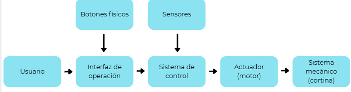

# Proyecto Mecatrónico – MR2022

## Problema
En esta situación problema se busca automatizar una cortina de uso industrial utilizada en un lugar donde circulan personas y vehículos de carga. La cortina puede tener diferentes dimensiones de ancho y altura, además de estar fabricada con hule termoformado y barras metálicas en la parte inferior para mantener la tensión, todo esto hace que la cortina tenga un peso elevado. Debido a esto, el sistema debe ser capaz de mover la cortina de forma controlada y segura.

La automatización debe permitir que la cortina se enrolle hasta una altura determinada y en un tiempo específico, el cual se debe poder ajustarse desde una interfaz de operación dentro de un rango de 5 a 10 segundos. También se necesita que la altura máxima de la cortina y los tiempos de espera se puedan configurarse desde la interfaz. El sistema tiene que ser capaz de operar tanto en modo manual como en modo automático, además se debe considerar que existen diferentes tipos de usuarios con permisos distintos. Algo fundamental es la seguridad, ya que durante el movimiento de bajada se debe detectar la presencia de personas u objetos para evitar accidentes y garantizar que su funcionamiento sea seguro.

## Arquitectura del sistema

## Componentes utilizados
- Sensor inductivo
- Sensor capacitivo
- Sensor óptico
- Sensor magnético
- Siemens LOGO
- Relés
- Motor DC 24V
- Torre de luces

## Lógica de control

El control del sistema fue implementado mediante un PLC Siemens LOGO! utilizando un diagrama de bloques (FBD). En este esquema se integran las señales de los sensores de entrada para controlar el movimiento de una cortina industrial automatizada.

Los sensores magnéticos permiten detectar las posiciones superior, media e inferior de la cortina, mientras que el sensor inductivo habilita el funcionamiento del sistema. El sensor óptico actúa como un elemento de seguridad, deteniendo el movimiento si detecta la presencia de una persona u objeto cercano. Además, se implementa un sensor capacitivo que funciona como paro manual del sistema.

La lógica incluye interlocks de seguridad que impiden condiciones peligrosas, como activar simultáneamente el movimiento de subida y bajada del motor o intentar mover la cortina cuando ya se encuentra en un límite de recorrido. Las salidas del sistema controlan el motor en ambas direcciones mediante relés y activan lámparas LED que indican el estado del sistema.

## Resultados de pruebas
Tabla de detección de sensores o pruebas del sistema.

## Video demo
[(link al video)](https://www.youtube.com/shorts/yC3Cw31sUlQ)

## Equipo

Joel Alejandro Soto Muñoz

Sara Gabriela Díaz Rayas

Claudio Daniel Gómez Zermeño

Max Emiliano Amezcua Camacho
